### Teespace E-commerce Customer Website
### Project Description

- git repo:`https://github.com/wing-ecommerce/ecommerce-dashboard-v2`
- hosting: `https://teespace-phi.vercel.app/`

Frontend application for the e-commerce system.

- Allows users to browse and filter products 
- Product Details
- Add products to cart (Add, Delete, Update qty)
- Authentication (Google Sign-in)
- Check out page and Place orders (Cash by Delivery)
- User Account 
  - Order history (view and cancel order)
  - Update user profile
  - AddressBook (Add, delete, update)

Built with Next.js and connected to the Spring Boot backend API.

### Table of Contents

- [Setup](#setup)
- [Environment Variables](#environment-variables)
- [Features](#features)
- [Authentication \& Authorization](#authentication--authorization)
- [Protected Routed](#protected-routed)
- [Tech Stack](#tech-stack)
- [Project Folder Structure](#project-folder-structure)
## Setup

 how to run local:
```
git clone https://github.com/wing-ecommerce/ecommerce-frontend
cd ecommerce-frontend
npm install
npm run dev
```

- run on: `http://localhost:3000`
## Environment Variables

```
# NextAuth Configuration
NEXTAUTH_URL=http://localhost:3000
NEXTAUTH_SECRET=

# Google OAuth
GOOGLE_CLIENT_ID=
GOOGLE_CLIENT_SECRET=

# Backend API
NEXT_PUBLIC_API_URL=http://localhost:8080
```

## Features
1. Home Page
   
    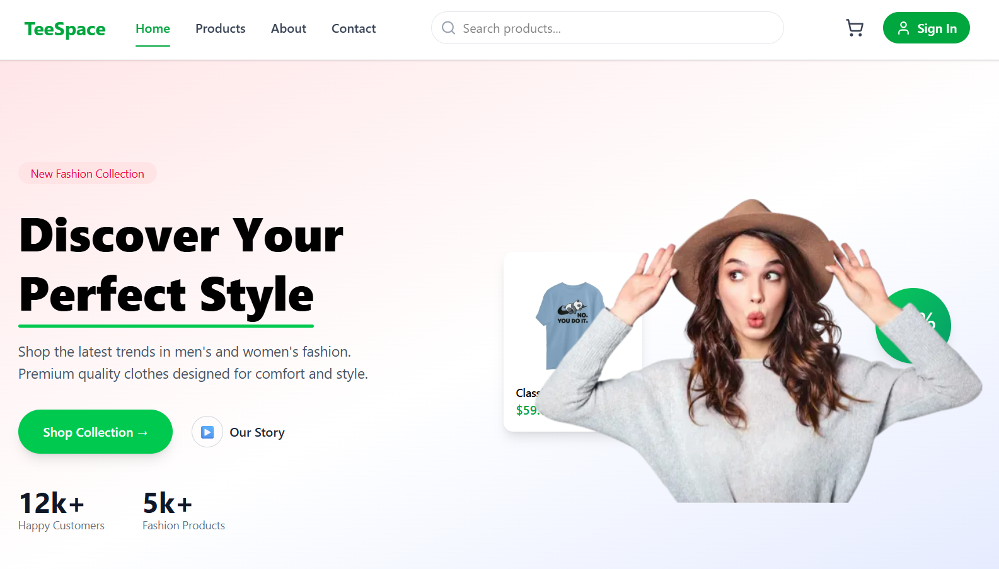

2. Product Page (Browse and Filter product by category)
   
    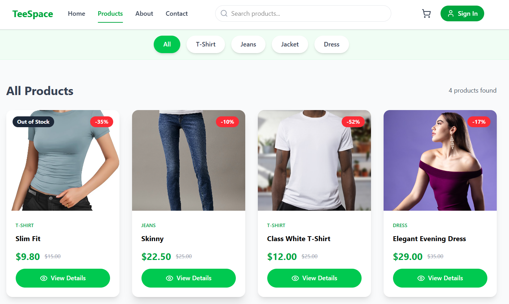
    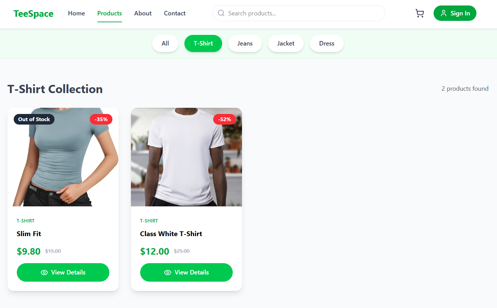

3. Product Detail Page
   
   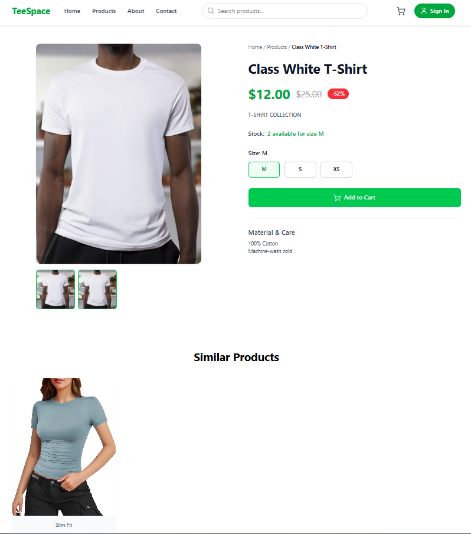

4. Add To Cart (User required to sign-in before add item to cart)
   
   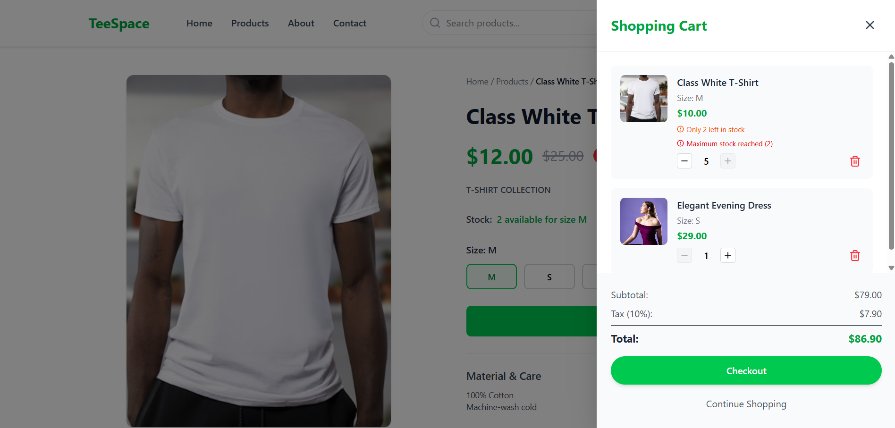

after add items to cart user can:
- update qty
- delete items from cart
- and proceed to Checkout

5. Checkout

    

- User required to fill all  the needed information such as address infomation and payment method. After that user can Place order and Proceed to Confirm order:

    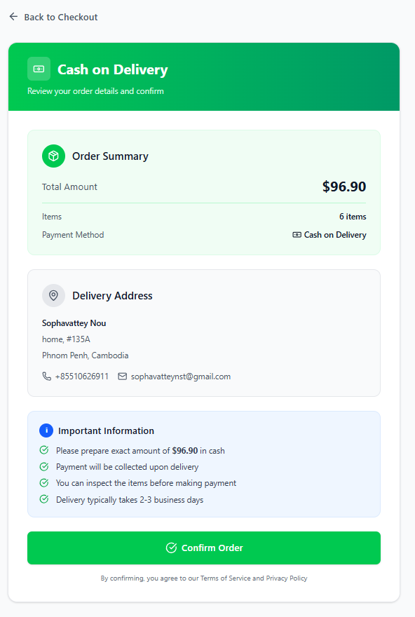

- Order Successfully! and cart items are removed, so user can whether go to view order history or continue to product page
  
    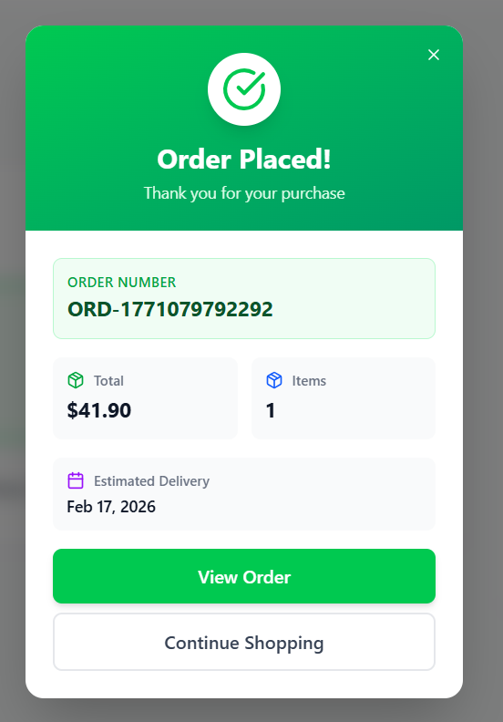

6. Account User (Profile, Order, and Address)

- Profile info: User can update thier information such as First name, Last name and phone number:
- 
    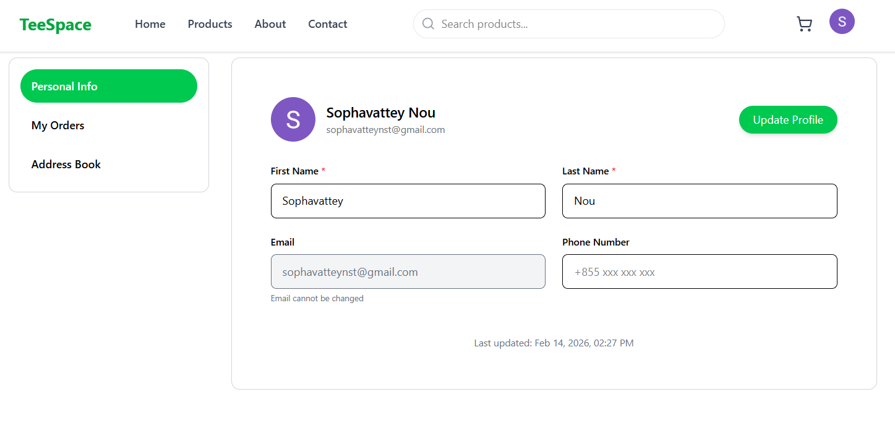

- Order History: User cancel the order the status is pending
  
    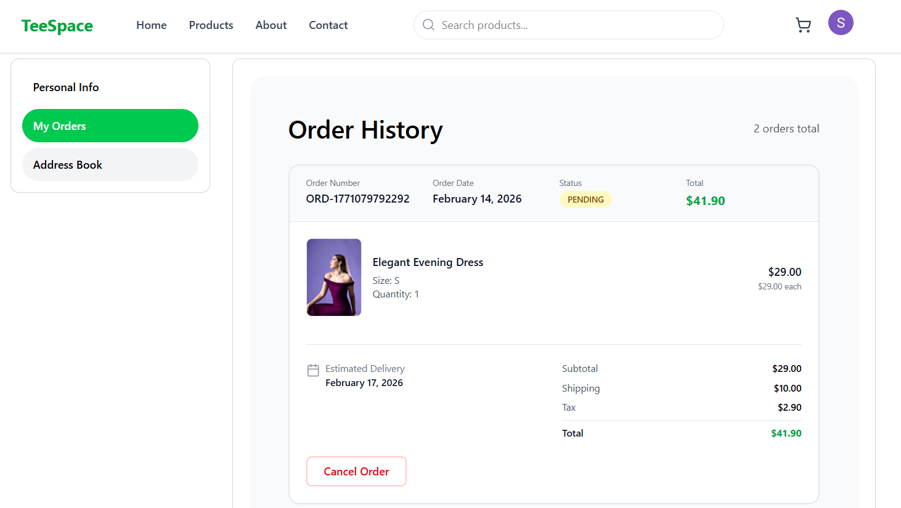

- AddressBook: User can add address, delete, update and set default address

    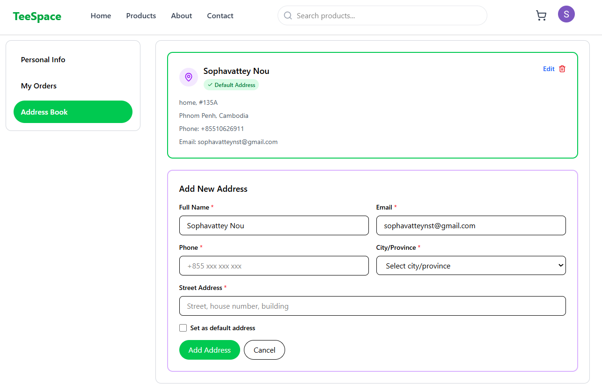

## Authentication & Authorization

1.  Authentication (Google Sign-in)
   
![alt text]./img/(image-1.png)

- The Process
```
User clicks "Sign in with Google"
            ↓
        NextAuth
            ↓
         Google OAuth
            ↓
        NextAuth receives user info
            ↓
      Spring Boot Backend
   - Check if user exists
   - Create user if not exists
   - Assign USER role
   - Generate JWT
            ↓
      Return JWT to Frontend
```
## Protected Routed
- Account (profile, orders, and address)
- Checkout
- add to cart function required user to sign-in first 
  
## Tech Stack

- Next.js
- TypeScript
- Tailwind CSS
- Axios
- JWT Authentication
- React Hooks

## Project Folder Structure
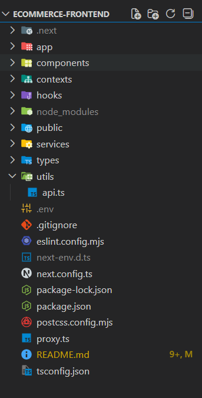
```
client-app/
├── app/
│   ├── (auth)/
│   │   ├── login/page.tsx
│   │   ├── register/page.tsx
│   │   └── layout.tsx
│   │
│   ├── (shop)/
│   │   ├── products/
│   │   │   ├── page.tsx
│   │   │   └── [slug]/page.tsx
│   │   ├── cart/page.tsx
│   │   └── checkout/page.tsx
│   │
│   ├── layout.tsx
│   ├── page.tsx        # homepage
│   └── globals.css
│
├── components/
│   ├── ui/
│   ├── layout/         # navbar, footer
│   ├── product/
│   ├── cart/
│   └── forms/
│
├── services/
│   ├── api.ts
│   ├── auth.service.ts
│   ├── product.service.ts
│   ├── order.service.ts
│   └── payment.service.ts
│
├── hooks/
│   ├── useAuth.ts
│   ├── useCart.ts
│   └── useFetch.ts
│
├── store/
│   ├── auth.store.ts
│   └── cart.store.ts
│
├── types/
│   ├── product.ts
│   ├── user.ts
│   └── order.ts
│
├── utils/
│   ├── constants.ts
│   ├── helpers.ts
│   └── validators.ts
│
├── middleware.ts       # client auth only
├── .env.local
├── next.config.ts
└── package.json
```
